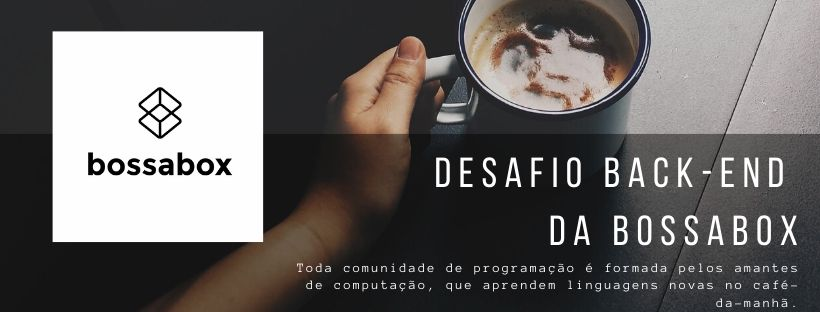

## Sobre

A aplicação pode ser construída utilizando qualquer linguagem, banco de dados, frameworks,
libraries e ferramentas de sua preferência (Ex: Node + Express + Mongoose + MongoDB, PHP + Lumen +
RedBean + PostgreSQL, etc). Apesar disso, a stack mais comum para squads aqui na BossaBox é Node.js,
seguida por PHP. Ruby é incomum, mas aparece em raros casos.

A API deverá ser documentada utilizando o formato API Blueprint ou Swagger.

### O que será avaliado

Queremos avaliar sua capacidade de desenvolver e documentar um back-end para uma aplicação. Serão avaliados:

- Código bem escrito e limpo;
- Quais ferramentas foram usadas, como e porquê, além do seu conhecimento das mesmas;
- Seu conhecimento em banco de dados, requisições HTTP, APIs REST, etc;
- Sua capacidade de se comprometer com o que foi fornecido;
- Sua capacidade de documentação da sua parte da aplicação.

### O mínimo necessário

- Uma aplicação contendo uma API real simples, sem autenticação, que atenda os requisitos descritos abaixo, fazendo requisições à um banco de dados para persistência;
- README.md contendo informações básicas do projeto e como executá-lo;
- API Blueprint ou Swagger da aplicação

### Bônus

Os seguintes itens não são obrigatórios, mas darão mais valor ao seu trabalho
(os em negrito são mais significativos para nós, se destacando como características para
se tornar Tech Lead em squads)

- Testes de front-end;
- Uso de ferramentas externas que facilitem o seu trabalho;
- Cuidados especiais com otimização, padrões, entre outros;
- Migrations ou script para configuração do banco de dados utilizado;
- Testes;
- Conteinerização da aplicação;
- Autenticação e autorização (OAuth, JWT);
- Pipelines de CI/CD (GitLab, CircleCI, TravisCI, etc);
- Deploy em ambientes reais, utilizando serviços de cloud externos (AWS, Heroku, GCP, etc);
- Sugestões sobre o challenge embasadas em alguma argumentação.

## Fluxo de Tarefa

| Task   |      Commit     |
|----------|:-------------:|
| feat: A API deve responder na porta 3000 | 949552a |
| feat: Deve haver uma rota para listar todas as ferramentas cadastradas | 95e9941 |

### 1: Deve haver uma rota para listar todas as ferramentas cadastradas

